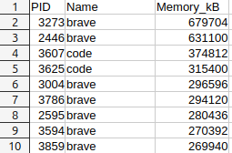
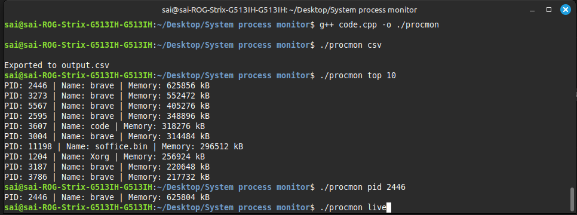

# 🧠 System Process Monitor (Linux)

A lightweight Linux system process monitoring tool built in C++. It reads from the `/proc` filesystem and displays **PID, process name, and memory usage** — with options for live monitoring, CSV export, and individual process inspection.

---

## 🚀 Features

- 📊 **Live Monitor**: View real-time memory usage of all running processes.
- 📁 **CSV Export**: Export all process memory info to `output.csv`.
- 🏆 **Top N Processes**: List top memory-consuming processes.
- 🔍 **PID Lookup**: Get memory info for a specific PID.

---

## 🧑‍💻 Usage

### 🔧 Compile the program:
```bash
g++ code.cpp -o procmon -std=c++17
```

### ▶️ Run with one of the following options:

| Command                 | Description                             |
| -----------------------|------------------------------------------|
| `./procmon csv`       | Export all process memory data to CSV   |
| `./procmon live`      | Live monitoring of memory usage         |
| `./procmon top N`       | Show top `N` memory-consuming processes |
| `./procmon pid <PID>`   | Show memory usage of a specific PID     |

---

## 📝 Examples

### 🔴 Live Mode (`live`)
```bash
./procmon live
```
Sample output:
```
PID: 3273 | Name: brave | Memory: 679704 kB
PID: 2446 | Name: brave | Memory: 631100 kB
...
```

### 📄 CSV Export (`csv`)
```bash
./procmon csv
```
Creates:
```
PID,Name,Memory_kB
3273,brave,679704
2446,brave,631100
...
```

### 📷 Preview

#### CSV File


#### Live Monitor Snapshot


---

## 📦 Future Roadmap

- 📈 Add ncurses-based TUI interface

---

## 💡 Why This Project?

- Understand the `/proc` filesystem
- Practice system-level C++ and file handling
- Build real-time CLI utilities using Linux internals

---

## 🤝 Contribution

Pull requests are welcome. For major changes, please open an issue first to discuss what you would like to change.

---

## 📜 License

MIT License © 2025 P Sai Maneesh
